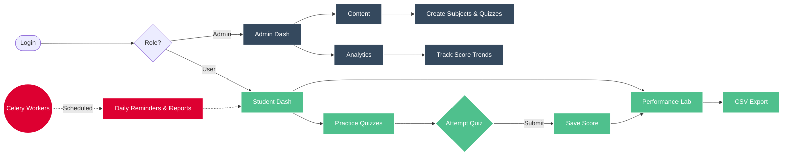

# Quizzo

[](https://www.python.org/)
[](https://flask.palletsprojects.com/)
[](https://vuejs.org/)
[](https://www.sqlite.org/)
[](https://redis.io/)
[](https://docs.celeryproject.org/)
[](https://getbootstrap.com/)
[](https://www.chartjs.org/)

A full-stack multi-user exam preparation platform with role-based access control, real-time analytics, and automated reporting capabilities.

## System Architecture



## Core Features

### Administrator
- Content management system for subjects, chapters, quizzes, and questions
- Real-time analytics dashboard with performance metrics
- Student account management and search functionality
- Quiz attendance tracking and score distribution analysis

### Student
- Timer-based multiple-choice quiz assessments
- Performance tracking with interactive visualizations
- Historical score analysis across subjects
- Asynchronous data export to CSV format

### Background Processing
- Scheduled daily reminders at 18:00
- Automated monthly report generation
- User-triggered asynchronous exports

## Technology Stack

**Backend**
- Flask 2.3+ with SQLAlchemy ORM
- Flask-Login for session management
- Flask-Caching with Redis backend
- Celery 5.3 for distributed task processing

**Frontend**
- Vue.js 3 (CDN-based SPA)
- Bootstrap 5 for responsive UI
- Chart.js for data visualization

**Data Layer**
- SQLite 3 for relational storage
- Redis 7.0+ for caching and message brokering

## Project Structure

```
app/
├── controllers/        API endpoints (auth, admin, user)
├── models/            Database models (User, Subject, Quiz, Score)
├── static/            Frontend assets (Vue.js, Chart.js)
├── templates/         Entry point (index.html)
├── tasks.py           Celery background jobs
└── config.py          Application configuration
```

## API Overview

| Endpoint | Method | Description |
|----------|--------|-------------|
| `/api/auth/login` | POST | User authentication |
| `/api/admin/subjects` | GET/POST | Manage subjects |
| `/api/admin/analytics/quiz/<id>` | GET | Quiz performance data |
| `/api/user/quizzes` | GET | Available quizzes (cached) |
| `/api/user/quiz/<id>/submit` | POST | Submit quiz answers |
| `/api/user/export` | POST | Trigger CSV export |

## License

MIT License